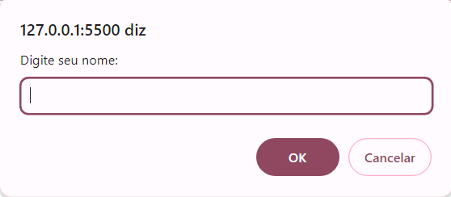
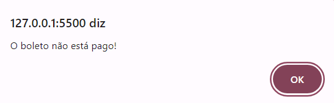
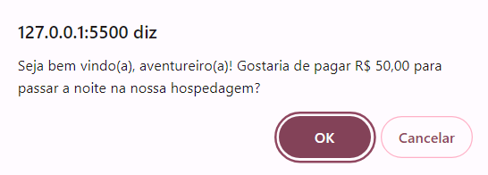
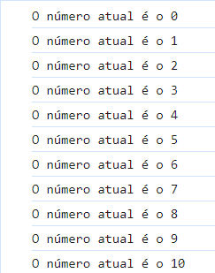
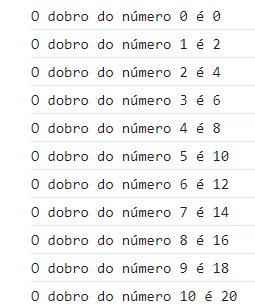

# 5 exercícios de JavaScript BÁSICO 
- Realizado no curso DevQuest

## 1: 
-> Objetivo
- Mostrar um alerta na tela para o usuário digitar seu nome

### Layout

## 2: 
-> Objetivo
- Mostrar um alerta na tela informando ao usuário que o boleto não está pago

### Layout

## 3: 
-> Objetivo
- Mostrar um alerta na tela para o usuário responder se aceita a proposta de hospedagem

### Layout

## 4: 
-> Objetivo
- Mostrar uma mensagem no console.log, falando o número atual

### Layout

## 5: 
-> Objetivo
- Mostrar uma mensagem no console.log, falando o dobro de um número

### Layout
